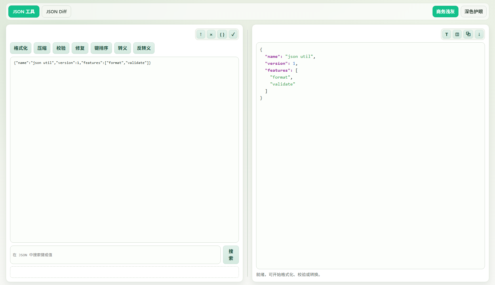

# JSON Tool Web

A browser-based JSON utility site built with Vite + TypeScript.

## UI Preview


## Features
- JSON format/minify/validate/repair/sort
- Escape / unescape string
- JSON text highlight output
- Side-by-side JSON diff with connector lines
- Theme switch (business light / eye-care dark)

## Dev
```bash
npm install
npm run dev
```

## Build
```bash
npm run build
npm run preview
```
